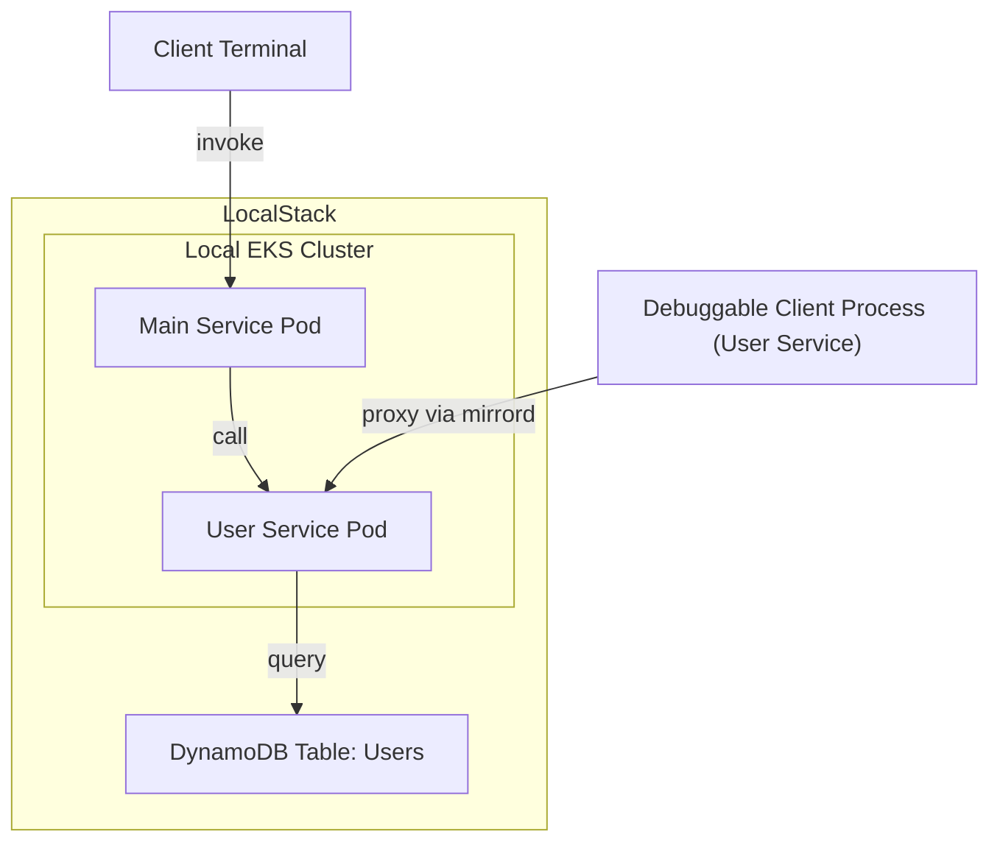

# LocalStack MirrorD Demo

This repo contains a simple demo app that illustrates local EKS application debugging using [LocalStack](https://www.localstack.cloud) & [MirrorD](https://metalbear.co/mirrord).

## Prerequisites

* LocalStack Pro (free trial license available)
* `kubectl` CLI
* `python`
* `make`

## Demo App Architecture

The diagram below illustrates the demo app architecture - it consists of a `Main` service that serves as the main entry point, and a `Users` service that maintains user entries in a local DynamoDB table.
Our goal is to deploy the app locally, and then use LocalStack and MirrorD to do live development and debugging of the app.



## Demo Flow

### Deployment

The project comes with Makefile that contains a couple of targets to run the demo app.

To install the dependencies, run the following command (you may be prompted for your sudo password to install the `mirrord` CLI):
```
$ make install
```

The `deploy` target creates a local EKS cluster and ECR repository in LocalStack, builds the Docker image for the application, and then deploys the app into local EKS.
The application (assumes the LocalStack is already running):
```
$ make deploy
```

The development status can be queried via (after some time, both pods should be in state `Running`):
```
$ make status
```

Once the app is deployed, you can query the main service via:
```
$ curl http://localhost:8081/main
```

### Development & Debugging

As a next step, let's assume we want to test some live changes to the `Users` service. We can run the following command, which spins up MirrorD and installs a proxy that intercepts requests to the `Users` service:
```
$ make debug-users-service
```

We can then make changes directly in the `services/users-service/service.py` file - the changes will take effect immediately, while still allowing us to interact with the local services inside LocalStack.

For example, we can add a temporary change to the API handler, to enable a condition expression that requires that the username attribute doesn't exist yet:
```
table.put_item(
    Item={ ... },
    ConditionExpression="attribute_not_exists(username)"
)
```

When invoking the API endpoint of the `Main` service multiple times in a row, you should start seeing an error, due to a conditional check failure in the DDB table:
```
botocore.errorfactory.ConditionalCheckFailedException: An error occurred (ConditionalCheckFailedException) when calling the PutItem operation: The conditional request failed
```

## License

The code in this repo is available under the Apache 2.0 license.
